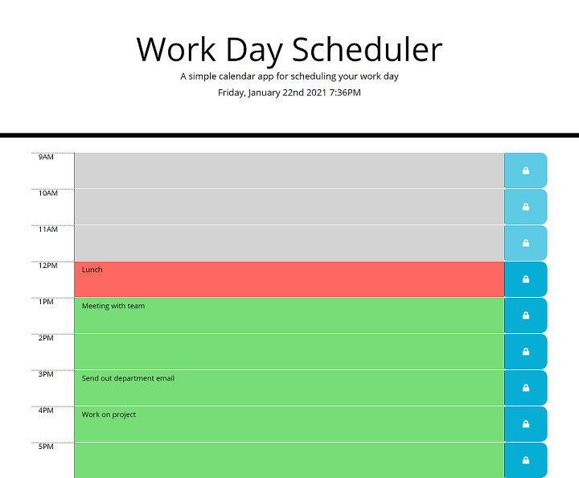

# day-planner

## Description

In this project, I created a simple calendar application that allows a user to save events for each hour of the day from 9AM to 5PM. The app will run in the browser and feature dynamically updated HTML and CSS powered by jQuery. The functionality is as follows:

* The current date and time will display in the header.
* A list of hours from 9AM to 5PM will display.
* Hours that are in the past will display in grey.
* Hours that are in the future will display in green.
* The present hour will display in red.
* A textarea will display next to each hour where the user will be able to enter an event.
* A button with a lock icon will display next to each textarea.
* If the user clicks on the lock button, the event they entered for that time will be saved.
* Hours that are in the past will not have editable textareas and their buttons will be disabled.
* The entered data will be saved to local storage so that when the user refreshes the page, the data will persist.

## Installation

This project requires the following files and folders:

* index.html
* assets/css/style.css
* assets/js/script.js

## Deployed Website

[Day Planner Website](https://johannaleal.github.io/day-planner/)

## Repository

[Code Repository](https://github.com/johannaleal/day-planner)

## Index.html Screenshot

